# OS-Jackfruit: Lightweight Multi-Container Runtime

A practical Linux container runtime and kernel memory monitor written in C. This project demonstrates supervised container lifecycle management, isolated namespaces, bounded-buffer logging, and kernel-enforced memory limits.

## Features

- Supervisor-managed container runtime with CLI control
- Concurrent container execution with isolated PID, UTS, and mount namespaces
- Per-container log capture for `stdout` and `stderr`
- Kernel module memory monitor with soft-limit warnings and hard-limit kills
- Built-in workload programs for CPU, I/O, and memory experiments
- Simple CLI: `supervisor`, `start`, `run`, `ps`, `logs`, `stop`

## Tech Stack

- C for user-space runtime and workloads
- Linux kernel module for memory monitoring
- Shell scripting for environment checks
- Makefile-based build system

## Prerequisites

- Ubuntu 22.04 or 24.04 VM
- Secure Boot disabled
- `sudo` privileges
- `build-essential`
- `linux-headers-$(uname -r)`
- No WSL support

## Setup

```bash
cd boilerplate
chmod +x environment-check.sh
sudo ./environment-check.sh
```

Install required packages:

```bash
sudo apt update
sudo apt install -y build-essential linux-headers-$(uname -r)
```

## Build

```bash
cd boilerplate
make
```

Verify with the CI-safe target:

```bash
make ci
```

## Prepare the Root Filesystem

Create the Alpine base root filesystem and per-container writable copies:

```bash
mkdir rootfs-base
wget https://dl-cdn.alpinelinux.org/alpine/v3.20/releases/x86_64/alpine-minirootfs-3.20.3-x86_64.tar.gz
tar -xzf alpine-minirootfs-3.20.3-x86_64.tar.gz -C rootfs-base
cp -a ./rootfs-base ./rootfs-alpha
cp -a ./rootfs-base ./rootfs-beta
```

> Use a unique writable rootfs directory for each running container.

## Usage

### Start the supervisor

```bash
cd boilerplate
sudo ./engine supervisor ./rootfs-base
```

### Start a background container

```bash
sudo ./engine start c1 ./rootfs-alpha /memory_hog --soft-mib 40 --hard-mib 64 --nice 10
```

### Run a container in the foreground

```bash
sudo ./engine run c2 ./rootfs-beta /cpu_hog --nice 5
```

### List containers

```bash
sudo ./engine ps
```

### View container logs

```bash
sudo ./engine logs c1
```

### Stop a container

```bash
sudo ./engine stop c1
```

## Command Reference

- `engine supervisor <base-rootfs>` — start the long-running supervisor
- `engine start <id> <container-rootfs> <command> [--soft-mib N] [--hard-mib N] [--nice N]` — launch a background container
- `engine run <id> <container-rootfs> <command> [--soft-mib N] [--hard-mib N] [--nice N]` — launch and wait for completion
- `engine ps` — list container metadata and state
- `engine logs <id>` — display logs for a container
- `engine stop <id>` — request clean shutdown of a container

## Architecture

- `engine` runs as a supervisor daemon and CLI client
- Supervisor manages container state, logging, and kernel monitor registration
- Container output is captured through pipes and written to per-container log files
- A bounded buffer preserves log data until it is safely flushed to disk
- Kernel memory monitor tracks host PIDs and enforces soft/hard memory thresholds

## Kernel Memory Monitoring

The kernel module provides:

- `/dev/container_monitor` control device
- PID registration from supervisor via ioctl
- periodic RSS tracking of monitored processes
- soft-limit warning events
- hard-limit termination with `SIGKILL`

## Folder Structure

- `boilerplate/`
  - `engine.c` — user-space supervisor and CLI runtime
  - `monitor.c` — kernel memory monitor module
  - `monitor_ioctl.h` — ioctl interface shared between user space and kernel
  - `cpu_hog.c` — CPU-bound workload
  - `io_pulse.c` — I/O-bound workload
  - `memory_hog.c` — memory allocation workload
  - `environment-check.sh` — environment verification script
  - `Makefile` — build and CI targets
  - `logs/` — runtime log outputs
- `screenshots/` — execution examples and output captures
- `project-guide.md` — assignment requirements and grading guide

## Demo Screenshots

This demo uses all provided screenshots to cover the eight required task areas.

1. **Multi-container supervision** — supervisor startup with multiple containers launched under one process.
   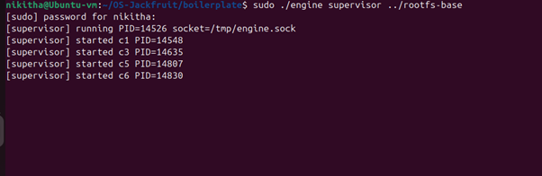
   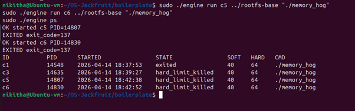

2. **Metadata tracking** — `engine ps` output showing tracked container IDs, states, and memory policy status.
   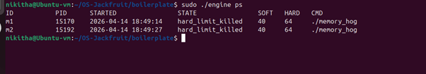

3. **Bounded-buffer logging** — captured log file output from the supervisor log pipeline.
   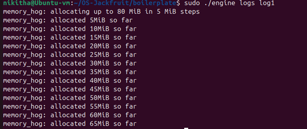

4. **CLI and IPC** — a supervisor accepting a CLI request while running containers.
   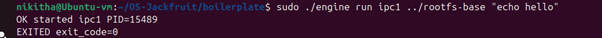
   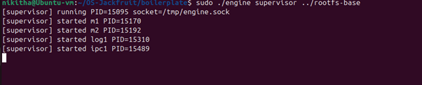

5. **Soft-limit warning** — kernel monitor `dmesg` output reporting a soft memory threshold breach.
   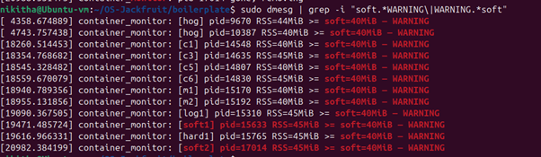

6. **Hard-limit enforcement** — kernel monitor `dmesg` output showing containers killed after exceeding hard limits.
   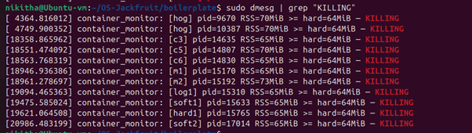

7. **Scheduling experiment** — CPU-bound workload output and timing measurement from the scheduler experiment.
   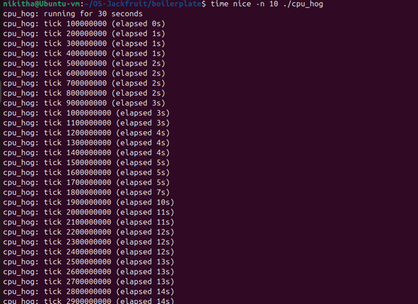(screenshots/10.png)

8. **Clean teardown** — process listings and defunct-check output showing no zombie processes after shutdown.
   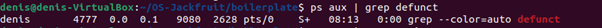
   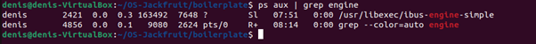


## Notes

- `run` returns the final container exit status.
- `stop` signals the supervisor to request a clean shutdown before terminating the process.
- `ps` distinguishes `running`, `stopped`, `exited`, and `hard_limit_killed` states.
- `memory_hog`, `cpu_hog`, and `io_pulse` are provided to validate enforcement and scheduling behavior.

## Contribution

Contributions should follow the existing C and shell conventions in `boilerplate/`, preserve supervisor and kernel monitor semantics, and keep logging behavior consistent.

## License

No license specified in this repository.

